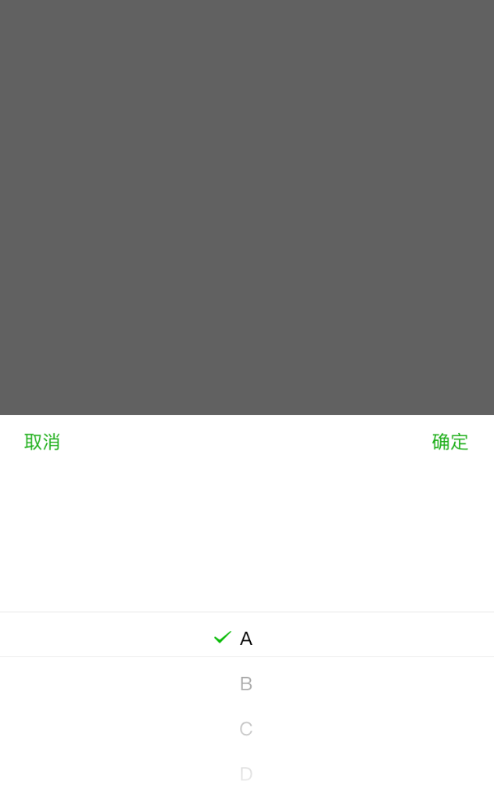
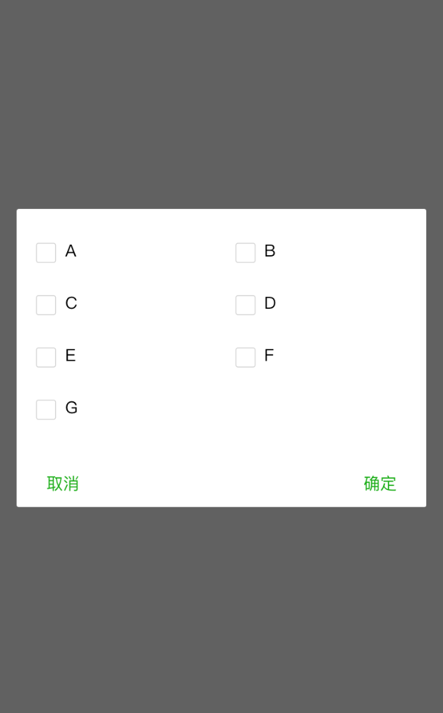

# mp-select

小程序自定义选择组件

## 使用

### 安装

```
npm install --save --production mp-select
```

### 引入

```json
{
  "usingComponents": {
    "mp-select": "/miniprogram_npm/mp-select/index"
  }
}
```

### 使用

#### wxml

```html
<mp-select type="select" range="{{range}}" value="{{value}}" bindsaveevent="bindchange" bindcancelevent="cancel" wx:if="{{show}}" ></mp-select>

```

#### js

显示

```javascript

select () {
  this.setData({
    show: true
  })
}

```

选择

```javascript

bindchange (e) {
  this.setData({
    value: e.detail.value,
    show: false
  })
}

```

取消

```javascript

cancel () {
  this.setData({
    show: false
  })
}

```

### 配置

#### type

select [默认] 单选

 

 multiple 多选

 

  checkbox 复选框

 

#### require

单选模式下设置 require 默认选中第一项